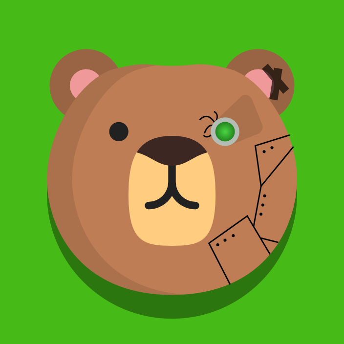

<!-- Improved compatibility of back to top link: See: https://github.com/othneildrew/Best-README-Template/pull/73 -->

<!--
*** Based on the Best-README-Template Repository.
*** Thank you to them for letting us spend less time making READMEs
*** And more time writing code.
-->

<!-- PROJECT LOGO -->
 

  

<h3 align="center">2024 Crescendo Code</h3>

  

    FRC Team 7913
     
    <a href="https://frc-7913.github.io/Crescendo-2024/"><strong>Explore our journal »</strong></a>
     
     
    <a href="https://www.thebluealliance.com/team/7913">The Blue Alliance</a>
    ·
    <a href="https://www.facebook.com/NRHS7913/">Facebook</a>
    ·
    <a href="https://www.thebluealliance.com/team/7913#event-results">Results</a>
  

<!-- TABLE OF CONTENTS -->

  
Table of Contents

  <ol>
    <li>
      <a href="#about-the-project">About The Project</a>
      <ul>
        <li><a href="#built-with">Built With</a></li>
      </ul>
    </li>
    <li>
      <a href="#getting-started">Getting Started</a>
      <ul>
        <li><a href="#prerequisites">Prerequisites</a></li>
        <li><a href="#robot-deployment">Robot Deployment</a></li>
      </ul>
    </li>
    <li><a href="#usage">Usage</a></li>
    <li><a href="#roadmap">Roadmap</a></li>
    <li><a href="#contributing">Contributing</a></li>
    <li><a href="#license">License</a></li>
    <li><a href="#contact">Contact</a></li>
    <li><a href="#acknowledgments">Acknowledgments</a></li>
  </ol>

<!-- ABOUT THE PROJECT -->
## About The Project

This is the robot code for FRC Team 7913 Bearly Functioning's 2024 Crescendo Season. This will be our 4th season competing, and we're hoping to do well.

This project includes documentation on our choices and how various components of the robot are implemented, in an effort to be more open. We hope this benefits future teams, both ours and others, in understanding the process behind coding our robot and the choices that went into it. Take a look at our journal/documentation [here](https://frc-7913.github.io/Crescendo-2024/). If you are interested in documenting your code similarly, check out [the page](https://frc-7913.github.io/Crescendo-2024/documenting/) on our documentation.

(<a href="#readme-top">back to top</a>)

### Built With

#### Robot Code
* [WPILib](https://wpilib.org/)

#### Documentation
* [Jekyll](https://jekyllrb.com/)
* [Just the Docs theme](https://just-the-docs.com/)

(<a href="#readme-top">back to top</a>)

<!-- GETTING STARTED -->
## Getting Started

This project is deployed in the same way as any other WPI Project. [Their page](https://docs.wpilib.org/en/stable/docs/software/vscode-overview/deploying-robot-code.html) also covers deployment.

### Prerequisites

This assumes you have a working RoboRio connected to power, with or without a transmitter.

> **Important:** You must build the robot code once while connected to the Internet to download all the dependencies.

To ensure all dependencies are downloaded, you must build the robot code before connecting to the robot WiFi. There are three ways to do this.

1. With WPILib VS Code, click on the WPILib icon or open the command palette and type "WPILib". Select `Build Robot Code`.
2. In IntelliJ, run the `Build Robot` task.
3. On the command line, run `gradle build` (with Gradle installed), `gradlew.bat build` (on Windows), or `./gradlew build` (on macOS or Linux).

Once the code dependencies are installed, connect to the robot. There are two ways to do this.

1. By WiFi. With the robot WiFi network set up, connect your computer to the robot's WiFi network
2. By cable. Connect an ethernet cable from the robot to your computer.

### Robot Deployment

With your computer connected to the robot, run the deploy task. 

In VSCode, click on the WPILib icon or open the command palette and type WPILib. Select `Deploy Robot Code`.

In IntelliJ, select the `Build & Deploy Robot` command.

On the command line, run `gradle deploy` (with Gradle installed), `gradlew.bat deploy` (on Windows), or `./gradlew deploy` (on macOS or Linux).

(<a href="#readme-top">back to top</a>)

<!-- USAGE EXAMPLES -->
## Usage

Each mode has a specific purpose.

##### Teleop
Fully operable, uses cameras to calibrate field position. To turn off camera features when not on a field to avoid bad readings of AprilTags, use `Test` mode. Selecting a driver station to work from for simulation may be helpful, too.

##### Autonomous
Runs the robot without driver input. If cameras and sensing aren't available, check the box on the Shuffleboard to select only auto modes without camera features.

##### Test
Has full driver control, but won't use cameras to calibrate position on field. Optionally, you can check a box to use camera calibration when running the shooter, which assumes you have AprilTags on a test Speaker.

_For more examples, please refer to the [Documentation](https://example.com)_

(<a href="#readme-top">back to top</a>)

<!-- ROADMAP -->
## Roadmap

See the [project](https://github.com/FRC-7913/project/Crescendo-2024) or the [issue list](https://github.com/FRC-7913/Crescendo-2024/issues) for a full list of proposed features (and known issues).

(<a href="#readme-top">back to top</a>)

<!-- CONTRIBUTING -->
## Contributing

Generally, work on this project will be done by the 7913 Programming team.
Contributions, however, are welcome if you see some glaring issue.

If you have a suggestion that would make this better, please fork the repo and create a pull request.
Otherwise, you can open an issue and tag it with `bug` or `enhancement`.

1. Fork the Project
2. Create your Feature Branch (`git checkout -b feature/AmazingFeature`)
3. Commit your Changes (`git commit -m 'Add some AmazingFeature'`)
4. Push to the Branch (`git push origin feature/AmazingFeature`)
5. Open a Pull Request

(<a href="#readme-top">back to top</a>)

<!-- LICENSE -->
## License

Distributed under the MIT License. See `LICENSE.txt` for more information.

(<a href="#readme-top">back to top</a>)

<!-- CONTACT -->
## Contact

Your Name - [@twitter_handle](https://twitter.com/twitter_handle) - email@email_client.com

Project Link: [https://github.com/github_username/repo_name](https://github.com/github_username/repo_name)

(<a href="#readme-top">back to top</a>)

<!-- ACKNOWLEDGMENTS -->
## Acknowledgments

* 
* 
* 

(<a href="#readme-top">back to top</a>)

<!-- MARKDOWN LINKS & IMAGES -->
<!-- https://www.markdownguide.org/basic-syntax/#reference-style-links -->
[contributors-shield]: https://img.shields.io/github/contributors/github_username/repo_name.svg?style=for-the-badge
[contributors-url]: https://github.com/github_username/repo_name/graphs/contributors
[forks-shield]: https://img.shields.io/github/forks/github_username/repo_name.svg?style=for-the-badge
[forks-url]: https://github.com/github_username/repo_name/network/members
[stars-shield]: https://img.shields.io/github/stars/github_username/repo_name.svg?style=for-the-badge
[stars-url]: https://github.com/github_username/repo_name/stargazers
[issues-shield]: https://img.shields.io/github/issues/github_username/repo_name.svg?style=for-the-badge
[issues-url]: https://github.com/github_username/repo_name/issues
[license-shield]: https://img.shields.io/github/license/github_username/repo_name.svg?style=for-the-badge
[license-url]: https://github.com/github_username/repo_name/blob/master/LICENSE.txt
[linkedin-shield]: https://img.shields.io/badge/-LinkedIn-black.svg?style=for-the-badge&logo=linkedin&colorB=555
[linkedin-url]: https://linkedin.com/in/linkedin_username
[product-screenshot]: images/screenshot.png
[Next.js]: https://img.shields.io/badge/next.js-000000?style=for-the-badge&logo=nextdotjs&logoColor=white
[Next-url]: https://nextjs.org/
[React.js]: https://img.shields.io/badge/React-20232A?style=for-the-badge&logo=react&logoColor=61DAFB
[React-url]: https://reactjs.org/
[Vue.js]: https://img.shields.io/badge/Vue.js-35495E?style=for-the-badge&logo=vuedotjs&logoColor=4FC08D
[Vue-url]: https://vuejs.org/
[Angular.io]: https://img.shields.io/badge/Angular-DD0031?style=for-the-badge&logo=angular&logoColor=white
[Angular-url]: https://angular.io/
[Svelte.dev]: https://img.shields.io/badge/Svelte-4A4A55?style=for-the-badge&logo=svelte&logoColor=FF3E00
[Svelte-url]: https://svelte.dev/
[Laravel.com]: https://img.shields.io/badge/Laravel-FF2D20?style=for-the-badge&logo=laravel&logoColor=white
[Laravel-url]: https://laravel.com
[Bootstrap.com]: https://img.shields.io/badge/Bootstrap-563D7C?style=for-the-badge&logo=bootstrap&logoColor=white
[Bootstrap-url]: https://getbootstrap.com
[JQuery.com]: https://img.shields.io/badge/jQuery-0769AD?style=for-the-badge&logo=jquery&logoColor=white
[JQuery-url]: https://jquery.com 